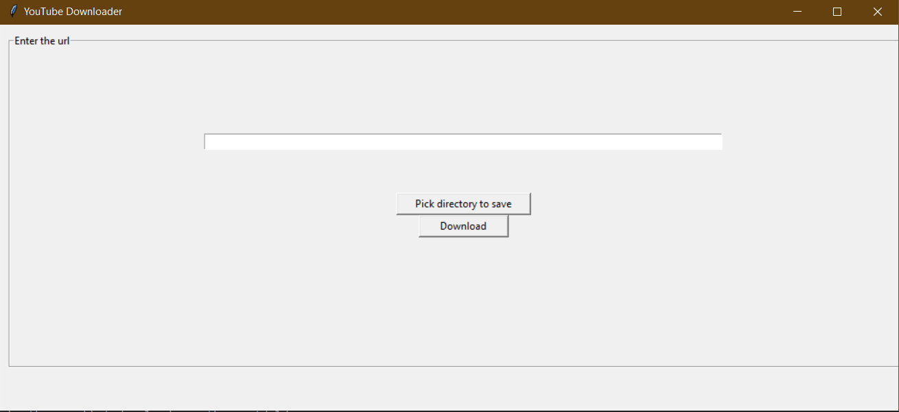

# YouTube Downloader

YouTube Downloader is a simple command-line interface (CLI) tool for downloading YouTube videos using the Pytube library.

## Installing

To get started, follow these steps:

1. Clone the repository:

    ```bash
    git clone https://github.com/your-username/YouTube_Downloader.git
    ```

2. Navigate to the project directory:

    ```bash
    cd YouTube_Downloader
    ```

3. Create and activate a virtual environment (optional but recommended):

    ```bash
    python -m venv venv
    source venv/bin/activate  # On Unix or MacOS
    venv\Scripts\activate     # On Windows
    ```

4. Install project dependencies:

    ```bash
    pip install -r requirements.txt
    ```

## Usage

Using YouTube Downloader is straightforward. Follow these steps:

1. Run the application:

    ```bash
    python "Youtube Downloader.py"
    ```

    This will launch the simple interface.

2. Select the directory to save the video:

    - Use arrow keys to navigate.
    - Press Enter to confirm.

3. Provide the YouTube video link:

    - Paste the YouTube video link when prompted.

4. Click download:

    - Press Enter to start downloading the video.

## Screenshot



### Note

This project is intended for educational purposes only. Make sure to respect YouTube's terms of service and the rights of content creators while using this tool.

## Contributing

Feel free to do whatever you wish with this project, if somehow you stumble uppon it!
